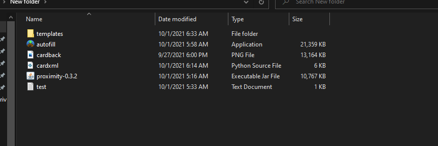

# GUI tool for Proximity

Things may break or change with proximity, I have a life and family so I will do my best to fix it but pull requests are always welcomed! The backend being in rust means its easy to extend this tool to work with almost any language using FFI or sending cli's.

# Local setup from .msi

MUST HAVE JAVA 16+ installed and Python 3 installed before running!

Download and install the msi into a folder
Add proximity.jar to the folder link in app
Add autofill.exe to the folder link in app
Add cardxml to the folder can be found in this repo
Add a cardback.png img (but be named cardback!) can be found in this repo
Add the template folder unzipped to the same folder
Add your deck list as a text file
When done it should look like this

- Run gui-helper
- Click on proximity location and select the folder you made above.
- Selected options turn things on they default to false (off)

# Local setup from source

So first things first this is not built for people to run locally if you don't have some tech knowledge. I will do my best to walk you through all of this as if you had none. Some things you need need installed are the following. Node 14, Visual Studios C++ build tools 2019! uninstall 2017 if you have issues, RustC and Cargo package manager (rustup) makes this easy. Lastly you need to install webview2 and your ready to go to the next steps.
Go ahead and clone or download this repo wherever you would like and then open it up in your editor of choice, I like vscode.
Once you have it open, open a terminal in the root folder ctrl/cmd + ` on windows/mac will do this then run the commands in order
npm i (this will take a long time the first time)
npm run start
OPEN ANOTHER SEPARATE TERMINAL!! VERY IMPORTANT! Then run
npm run tauri dev (will take a long time first time around!)

# Deploy setup

If you don't know what this is or how to do it, simply download the released ver of the program or try to figure this out on your own. This step should not be needed by none devs.

npm run build
npm run tauri build

# What it does

Creates the command line based on options and file locations

TODOS:

Checks for Java is installed (X)

Create cmd object for options selected (X)

Send object to rust (X)

Send path to rust (X)

Exec command in rust (X)

Helps you pick your deck list and ensures it is in the correct format (TODO)

Checks for template zip or folder (X)

Check what template options they have and have them select what one they want to use via dropdown (TODO)

Generates a xml card list to use with autofill tool (TODO)

# Current proximity options supported

You can find a full list of options [here](https://github.com/Haven-King/Proximity/wiki/Options#built-in-options)

- use_official_art (bool) -> false
- reminder_text (bool) -> false
- debug (bool) -> false
- threads (int) -> 10
- border (string) -> black or none
- artist_outline (bool) n/a for now
- copyright (bool)
